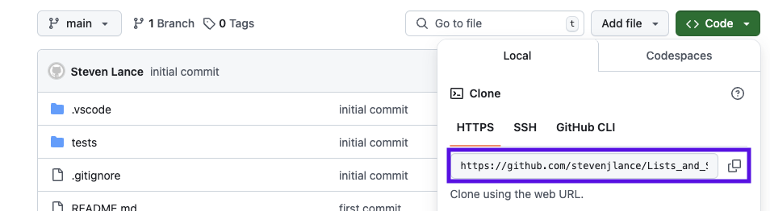
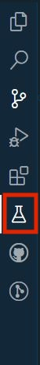
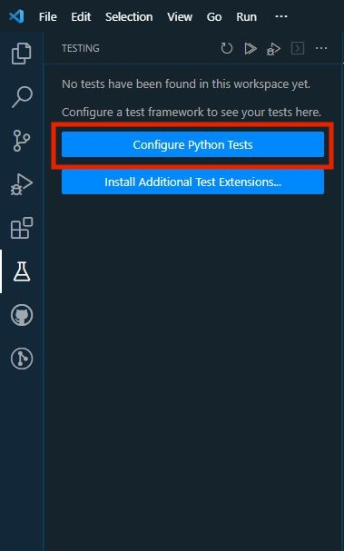
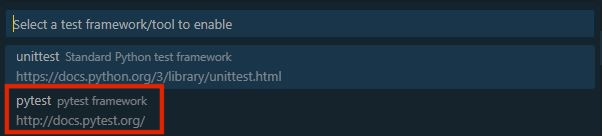
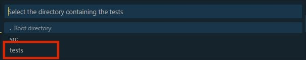
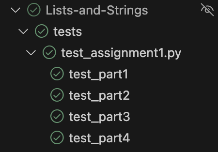

# Lists_and_Strings

Lists are one of the most integral parts of any programming language. They ensure that we can

## Cloning This Repository

To start the assignment, open up your terminal on your machine and type `git clone https://github.com/stevenjlance/Lists_and_Strings.git`. You can get the URL in this command by pressing the green Code button and then coppying the URL that appears.



## Running Your Code

1. To run your code use the command

```bash
python3 NAME_OF_FILE
```

For example, for the first first assignment you will use the command

```bash
python3 assignment1.py
```

Anything you are outputting to the console with a `print()` statement will appear in your terminal when you run this command.

## Grading Your Code

Your code is setup so that it can grade itself using Python tests. To run the tests do the following:

1. After you have cloned the repository down, click the flask icon in the left tool bar.



2. Next, click "Configure Python Tests".



3. You'll havae two options to select. Select Pytest.



4. Select the folder that contains the tests. In this case you should select **tests**.



5. Finally, you'll see a play icon that you can press to run each of the test. All of the tests in `test_assignment1.py` will grade your code for each part in assignment #1 and all code in `test_assignment2.py` will grade your code for each part in assignment #2.



6. Click the play button next to `test_part1` and you'll see that it turns red. That's okay! You haven't done any code yet. Start Assignment #1 and press the play button after part 1 to check your work.

## Assignment #1: Python Lists

> All of this work should be done in the [assignment1.py](assignment1.py) file.

### PART 1: CREATE, UPDATE, READ, DELETE

> **NOTE**: In order for the tests to work, some variables have been created with the value of `None`. You should delete `None` and update it with your code.

1. Initialize a variable avengers as an list. Assign the list the following values: `"Iron Man", "Thor", "Captain America", "The Hulk", "Spider Man", "Ant Man", "Batman"`
2. Using index notation, store the third avenger in the avengers list in the `thirdAvenger` variable. Replace `None` with your code.
3. Using index notation, replace `"The Hulk"` with `"Captain Marvel"` in the avengers list.

🛑 **STOP AND CHECK**: Check that your answers are correct by running test_part1 as instructed in the [Grading Your Code](#grading-your-code) section above. Move on **only** if you have passed the first set of tests.

### PART 2: Updating Lists and List Methods

Using the provided `fruits` list, complete the following

4. That forth element doesn't look right...update it to `"strawberry"`.
5. The bananas are too bendy! Find `"banana"` and delete it!
6. Add `"orange"` to the beginning of the list
7. Add `"raspberry"` to the end of the list
8. Insert `"mango"` into the fruits list as the 6th item

🛑 **STOP AND CHECK**: Check that your answers are correct by running test_part2 as instructed in the [Grading Your Code](#grading-your-code) section above. Move on **only** if you have passed the first set of tests.

### PART 3: Larger Lists and Spicier List Methods

A list of punny jokes have been imported into the file and saved the variable `punny_jokes`.

9. The list is quite large, save the number of jokes in the variable number_of_jokes.
10. Get the last joke on the list and save it to the favorite_joke variable
11. Find the index of the following joke and save it to the variable golf_joke: "Why did the golfer bring two pairs of pants? In case he got a hole in one."
12. STRETCH: Make a copy of the punny_jokes list and save it to the variable reverse_aphabetized. Then, sort the list in REVERSE alphabetical order.

🛑 **STOP AND CHECK**: Check that your answers are correct by running test_part3 as instructed in the [Grading Your Code](#grading-your-code) section above.

### PART 4: ITERATE

13. You have a list of numbers provided. Iterate through the list and sum up all the values. Store the final result in the variable `sum` that currently has the value of 0.
14. You have an list called `oddNums` and an empty list called `evenNums`. Increase each number by 1 and add it to evenNums (i.e. the new list should have the values, 2, 4, 6, 8, etc.)

🛑 **STOP AND CHECK**: Check that your answers are correct by running test_part3 as instructed in the [Grading Your Code](#grading-your-code) section above.

### BONUS

The problems below are extra practice to help you extend your knowledge of lists! They are not required, but are very helpful as you grow in your knowledge of how to manipulte values in lists.

15. Find the maximium and minimum numbers in the numbers list. Save them in the max_val and min_val variables
16. Iterate through the all_even array, increase the value by 1 ONLY if the number is odd, and add it to the end of the all_even array. If the number is even, simply add it to the end of all_even without changing the value. Thus, your final list should be only even numbers.
17. You really like jokes that start with the phrase "Why". Iterate through punny_jokes and if the joke starts with the phrase Why then add it to the end of the why_jokes list. If it doesn't start with the phrase Why, do not add it to the why_jokes list.

## Assignment #2: String Indexes and Methods
